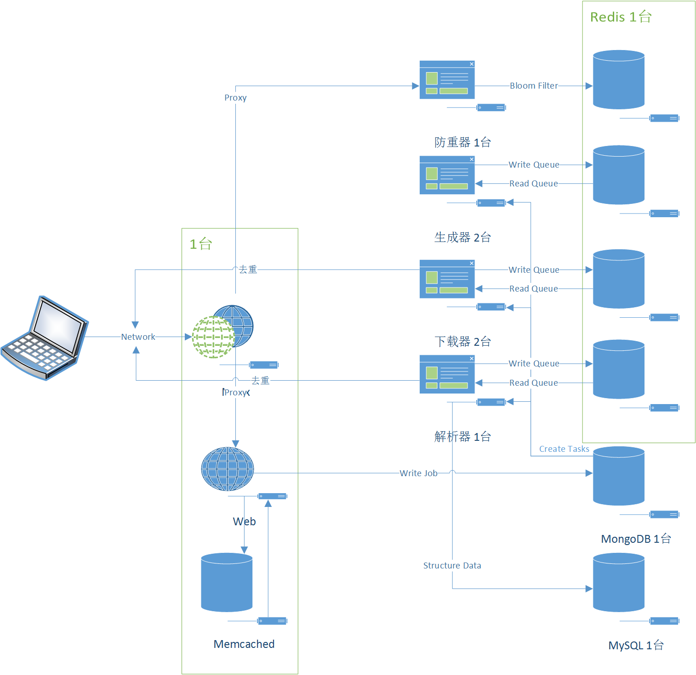
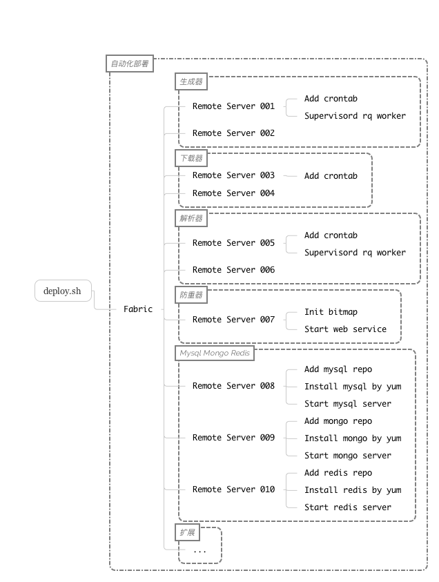

# 目标

方便开发和运营人员自动化部署开发和生产环境。

# 设计

为了简化开发和运营人员部署环境的难度，我们将使用Fabric自动化部署工具实现如下子标题的功能。要使用Fabric部署，需要在本机（是开发机器，不是Linux服务器）安装Fabric，最终只需要在本机执行一个脚本`sh deploy all`在多台服务器上生成我们所需要的所有环境并在不同的服务器启动不同的服务，当然也可以指定只生成其中某一个所需的环境和服务`sh deploy downloader`（比如扩展下载器）。

## 网络拓扑图：



## 自动化部署的思路：

1. 将Git仓库代码打包成发布版本，这里压缩格式使用`7z`，打包后生成`cr-clawer-2016-04-23.12334.7z`文件
2. 将步骤1生成的文件上传到公网服务器或阿里的OSS服务端，最终得到可以网络下载的地址
3. 准备多台生成环境服务器，服务器必须是CentOS7系统
4. 将本机的公钥上传到多台生产服务器，这样便于之后的自动化部署，否则每次都需要输入相应服务器的密码
5. 为不同的功能分配生产服务器，通过在配置文件中添加公网IP的形式实现
6. 本机执行自动化部署脚本`sh deploy all`，自动化部署的流程如下：
    1. 通过网络下载步骤1生成的文件
    2. 解压到服务器指定服务器目录，就比如现在的公网目录结构`/home/webapps/`，当然这个可以具体再定
    3. 切换到服务器项目目录
    4. 执行具体不同功能机对应的安装脚本，这里的安装脚本在`project/deploy/*/*.sh`，准备为每一个功能模块都创建安装脚本，也需要约定一些通用的配置（如crontab）

## 部署执行过程图



## 自动化部署脚本将实现如下功能：

- 生成器部署
- 防重器部署
- 下载器部署
- 解析器部署
- 破解器部署
- MySQL部署
- Mongo部署
- Redis部署
- Nginx部署

问题1：项目代码如何更新？

1. 如果是Git仓库的形式的打包，直接执行git pull，如果只是打包项目代码，则需要考虑如何检测更新和获取更新，打包是全量还是增量，当然增量是最理想的解决方案，但实现相对复杂。综上得出git仓库的形式是最简单的实现方式。

# 目录

```
.
├── captcha
│   └── init.sh
├── collector
│   └── init.sh
├── deploy.sh
├── fabfile.py
├── mongo
│   └── install_mongo-3.2.sh
├── mysql
│   └── install_mysql-5.7.sh
├── nginx
│   ├── config-nginx
│   │   ├── fastcgi.conf
│   │   ├── nginx
│   │   ├── nginx.conf
│   │   ├── rewrite
│   │   │   └── default.conf
│   │   └── vhosts
│   │       ├── default.conf.bak
│   │       └── phpwind.conf
│   └── install_nginx-1.4.4.sh
├── redis
│   └── install_reids-3.0.sh
├── requirements
│   ├── development.txt
│   ├── production.txt
│   └── test.txt
├── servers.json
└── structure
    └── init.sh
```


# 配置

编辑`project/deploy/servers.json`，`hosts`字段是有服务器的公网IP地址组成的列表，hosts的内容是可重复的，其中key的含义如下：

```
"GeneratorServers":       部署生成器服务器列表
"FilterServers":          部署防重器服务器列表
"DownloaderServers":      部署下载器服务器列表
"StructureSevers":        部署解析器服务器列表
"CaptchaServers":         部署破解器服务器列表
"MysqlServers":           部署MySQL服务器列表
"MongoServers":           部署MongoDB服务器列表
"RedisServers":           部署Redis服务器列表
"NginxServers":           部署Nginx服务器列表
```

```
{
    "GeneratorServers": {
        "hosts": ["127.0.0.1"]
    },
    "FilterServers": {
        "hosts": []
    },
    "DownloaderServers": {
        "hosts": ["192.168.99.100"]
    },
    "StructureSevers": {
        "hosts": []
    },
    "CaptchaServers": {
        "hosts": []
    },
    "MysqlServers": {
        "hosts": []
    },
    "MongoServers": {
        "hosts": []
    },
    "RedisServers": {
        "hosts": []
    },
    "NginxServers": {
        "hosts": []
    }
}
```

# 使用

```
Usage: ./deploy.sh {all|captcha|downloader|filter|genertor|mongo|mysql|nginx|redis|structure}

        all:            所有环境部署
        mongo:          MongoDB部署
        mysql:          MySQL部署
        nginx:          Nginx部署
        redis:          Redis部署
        filter:         防重器部署
        captcha:        破解器部署
        genertor:       生成器部署
        downloader:     下载器部署
        structure:      解析器部署
```
